
 

wexCommerce is an eCommerce platform optimized for SEO with multiple interesting features. wexCommerce is optimized for SEO so that products can be indexed by search engines.

# Features

* Stock management
* Order management
* Client management
* Multiple payment methods (Credit Card, Cash On Delivery, Wire Transfer)
* Multiple delivery methods (Home delivery, Store withdrawal)
* Multiple language support (English, French)
* Responsive backend and frontend

# Links

* [Installing](https://github.com/aelassas/wexcommerce/wiki/Installing)
* [Run from Source](https://github.com/aelassas/wexcommerce/wiki/Run-from-Source)
* [Documentation](https://github.com/aelassas/wexcommerce/wiki)

# Overview

## Frontend

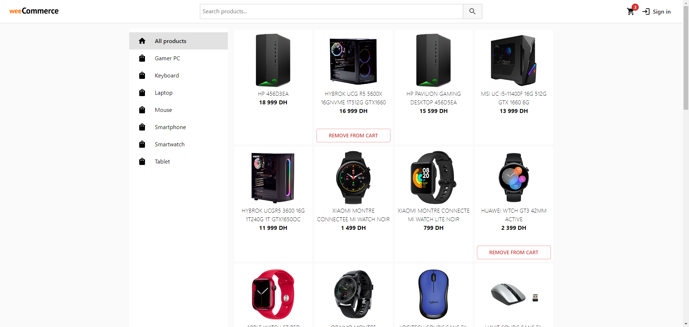

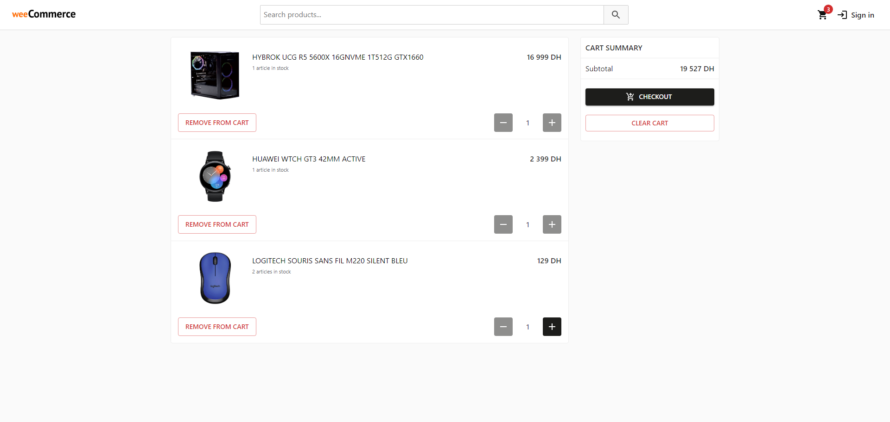

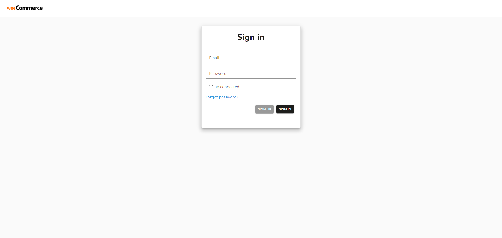
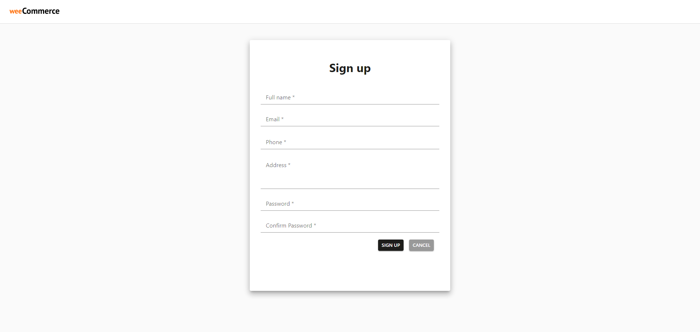
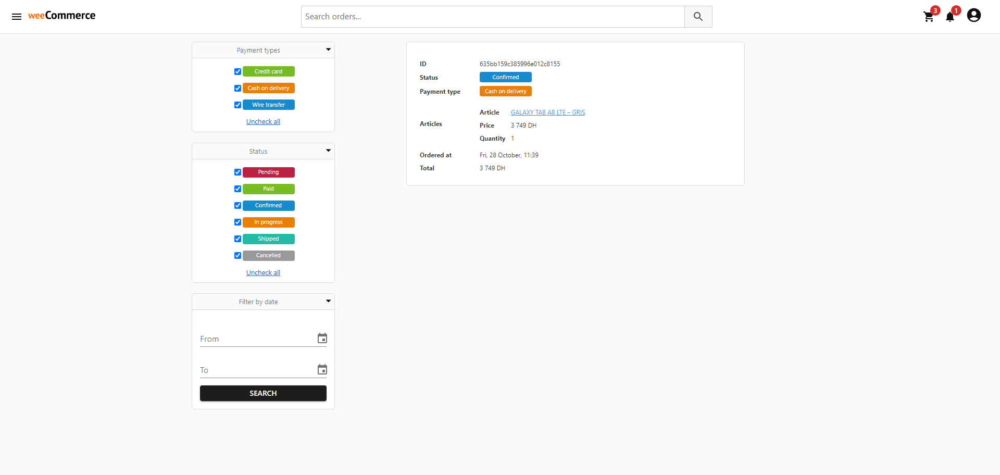

## Backend

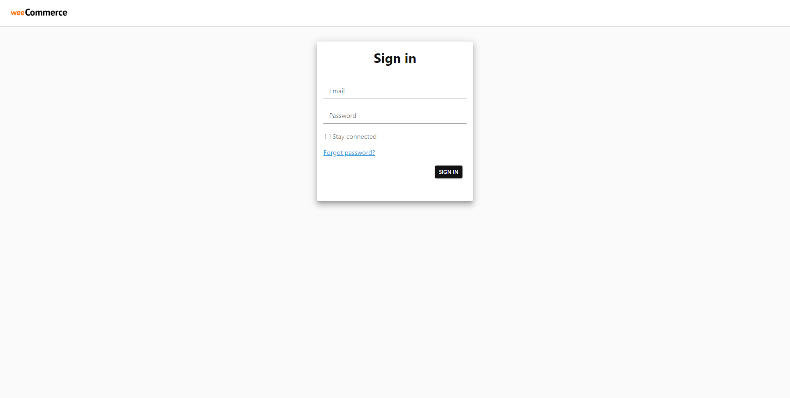
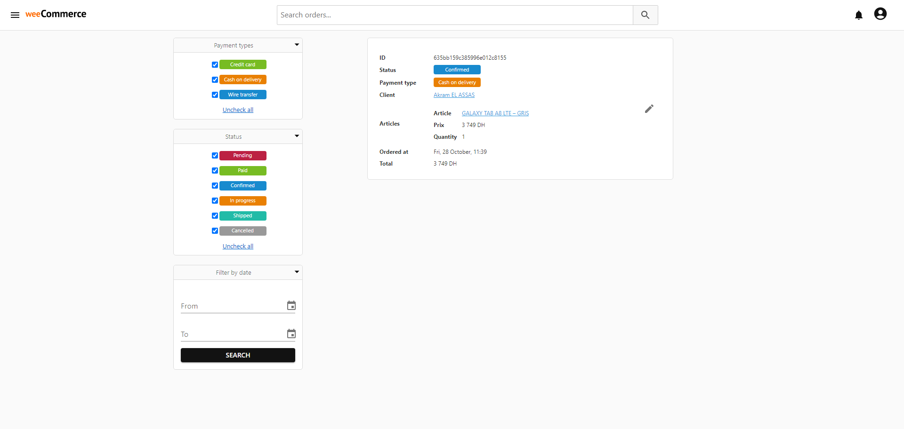
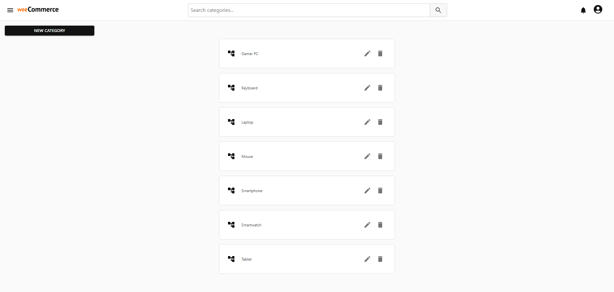
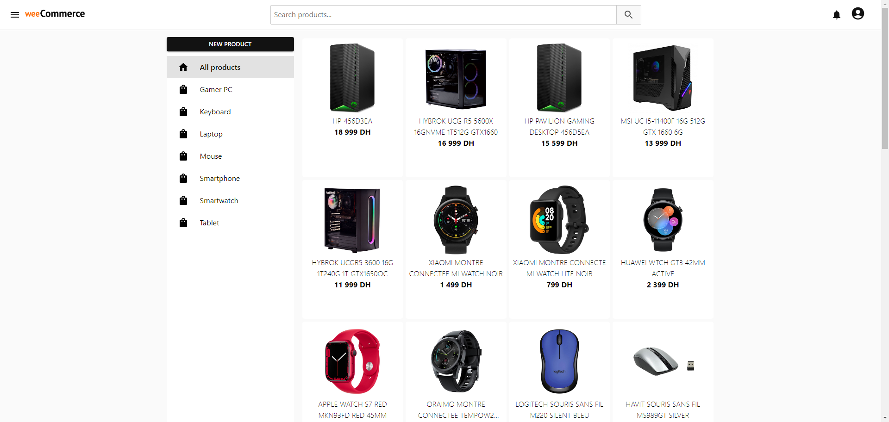
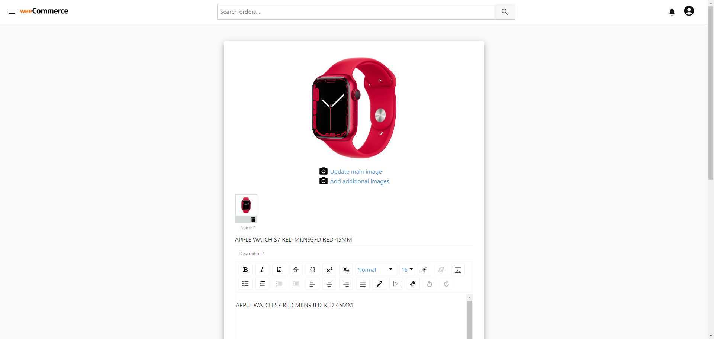
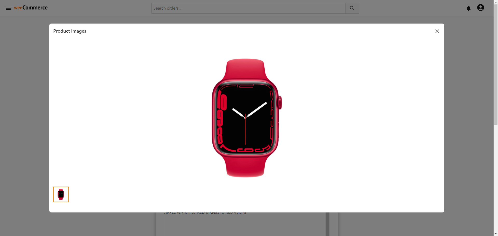
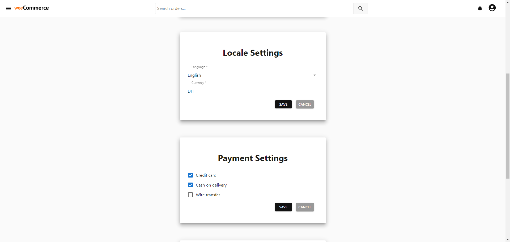
